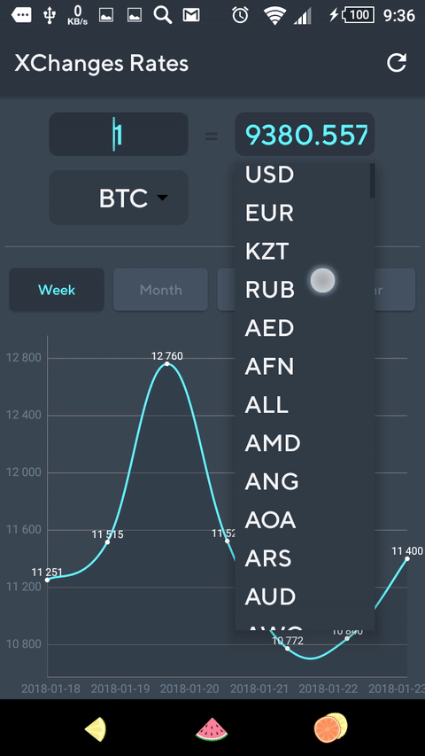
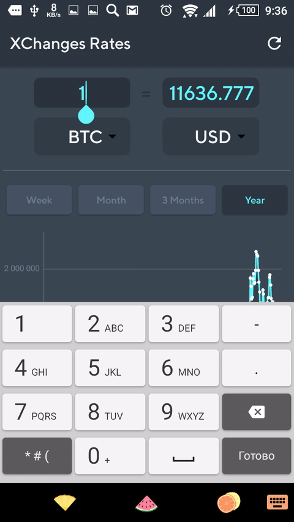

## XChanges Rates ##
It is a test project for job apply.
Design inspired by https://dribbble.com/shots/2641898-Currency-exchange-app-animation

  
 

 

  
 

<a name="overview" />

## Overview ##

### Permissions: ###

* Internet
* Access Network State

### Возможности приложения: ###

* Fast loading of Bitcoin currencies
* Awesome design by https://dribbble.com/awesomed

### Used libraries (used minimum as I can) ###

* MPAndroidChart https://github.com/PhilJay/MPAndroidChart
* Retrofit 2 https://github.com/square/retrofit
* ButterKnife https://github.com/JakeWharton/butterknife
* Hawk 2 https://github.com/orhanobut/hawk

<a name="license" />

## License
<pre>
Copyright 2017 Akbolat Sadvakassov 

Licensed under the Apache License, Version 2.0 (the "License");
you may not use this file except in compliance with the License.
You may obtain a copy of the License at

    http://www.apache.org/licenses/LICENSE-2.0

Unless required by applicable law or agreed to in writing, software
distributed under the License is distributed on an "AS IS" BASIS,
WITHOUT WARRANTIES OR CONDITIONS OF ANY KIND, either express or implied.
See the License for the specific language governing permissions and
limitations under the License.
</pre>